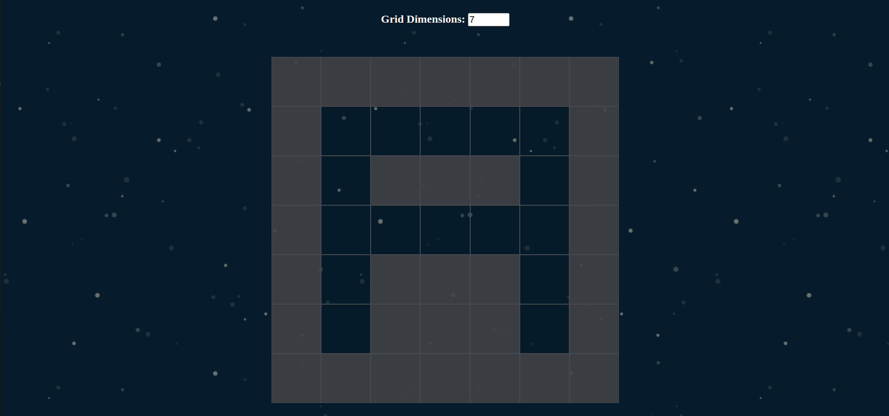

# Etch-A-Sketch

This is a solution to the [Etch-A-Sketch on The Odin Project](https://www.theodinproject.com/paths/foundations/courses/foundations/lessons/etch-a-sketch-project)

## Description

In this project, you’ll be creating a pretty neat toy for your portfolio to flex your DOM manipulation skills. You’re going to build a browser version of something between a sketchpad and an Etch-A-Sketch.

This project should not be easy for you. You’ll probably have to Google frequently to get the right JavaScript methods and CSS to use – in fact, that’s the point! You can build this using the tools that you have already learned, and there are plenty of resources on the net for learning stuff that we haven’t covered yet if you decide you need it. We’ll walk you through the basic steps, but it will be up to you to actually implement them.

### Screenshot

#### Desktop

### Links

- Solution URL: (https://github.com/AlexanderC04/etch-a-sketch.git)
- Live Site URL: (https://alexanderc04.github.io/etch-a-sketch/)

## Author

- Website - (https://github.com/AlexanderC04)
- Frontend Mentor - (https://www.frontendmentor.io/profile/AlexanderC04)
